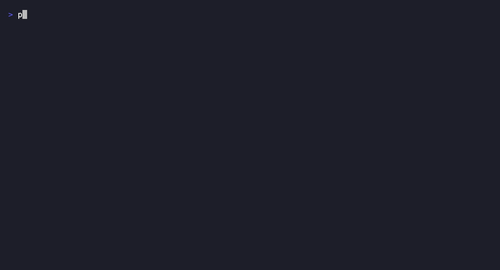

# installwall

Check direct package installs before a coding agent runs them. installwall puts
small shims ahead of `npm`, `pip`, `pip3`, `gem`, and `cargo` on `PATH`. A shim
checks each explicitly named package against typosquat, package age, and sourced
malicious-name rules, then either runs the real package manager or blocks it.

In a live PyPI check on 2026-09-30, `reqeusts` was blocked as a one-edit typo of
`requests`, while `requests` was allowed.[^check] The embedded indicator snapshot
contains 1,510 distinct package names with OSV advisory links.[^indicators]

[^check]: MacBook Air M5, Go 1.27.1, `go run ./cmd/installwall check reqeusts
    --ecosystem pypi --json` and the same command with `requests`. This checks two
    names, not a detection rate. The first command exits 1 because the install is
    blocked.

[^indicators]: Counted the rows in `internal/rules/data/malicious.json` on
    2026-09-30. This is a local snapshot, not a live OSV feed. See
    [rule data](internal/rules/data/SOURCES.md) for scope and exclusions.

[](https://github.com/Arthur031221/installwall/actions/workflows/ci.yml)
[](LICENSE)
[](CHANGELOG.md)



## Why

Agents often run an install command as part of a task. A typo in a package name
can become a supply-chain incident before a post-install audit runs. installwall
checks the direct names in that command and records what it decided. Its scope is
deliberately narrow: it is a guard for named installs, not a substitute for a
dependency audit or a lockfile review.

## Install

Go 1.27.1 or newer is required to build from source:

```sh
go install github.com/Arthur031221/installwall/cmd/installwall@v0.1.0
```

Make sure `$(go env GOPATH)/bin` is on `PATH`, then check a package without
changing your shell:

```sh
installwall check reqeusts --ecosystem pypi --why
```

The check exits 1 when it blocks a package. To intercept future direct installs:

```sh
installwall install
```

The command prints the `PATH` line for your shell profile. Add it or run
`installwall install --yes` to append it for you, then open a new shell.
`installwall uninstall` removes the shim scripts. Remove the `PATH` line from your
profile yourself.

## Quick start

After installing the shims, run:

```sh
pip3 install reqeusts
installwall audit --limit 3
```

The first command is blocked before `pip3` runs. The audit command shows the
decision. `installwall check requests --ecosystem pypi --json` shows an allowed
result without installing anything.

## How it works

The shim parses explicit package names from `npm install`, `pip install`,
`gem install`, `cargo install`, and `cargo add`. It checks them against a local
set of cited OSV malicious-package names, an edit-distance-one match against
popular names for that registry, and the registry's first-publication timestamp
when available. A package younger than 72 hours is blocked. If the registry is
unreachable, installwall warns and permits the command. Blocked commands are
not passed to the real package manager.

The audit log is JSONL in `~/.installwall/`. `INSTALLWALL_HOME` can redirect
the shim directory and log for tests or a disposable setup. The Go binary has
no third-party Go dependencies.

## Comparison

| Tool | Checks direct named installs before execution | Main purpose |
| --- | --- | --- |
| installwall | Yes, for supported commands | Typosquats, new packages, and sourced malicious names |
| [npm audit](https://docs.npmjs.com/auditing-package-dependencies-for-security-vulnerabilities/) | No | Audit configured npm dependencies for known vulnerabilities |
| [pip-audit](https://github.com/pypa/pip-audit) | No | Audit Python environments and project dependencies |
| [cargo audit](https://github.com/rustsec/rustsec/tree/main/cargo-audit) | No | Audit Rust dependencies against RustSec advisories |

Use those auditors as well. installwall does not inspect resolved dependency
trees or replace version-aware vulnerability matching.

## Reference

```text
installwall install [--yes]
installwall uninstall
installwall check <package> [--ecosystem npm|pypi|rubygems|crates] [--why] [--json]
installwall audit [--limit N] [--json]
installwall exec <tool> -- <args>
installwall version
```

`exec` is called by the generated shims. Most users should run their package
manager normally after adding the shim directory to `PATH`.

## Limits

- Commands that install from a manifest or requirements file without an explicit
  package name, such as `npm install` or `pip install -r requirements.txt`, pass
  through. Transitive dependencies are not checked.
- The malicious-name snapshot is static. An advisory for one bad version of an
  otherwise legitimate package is not a safe reason to block its whole name, so
  known version-specific cases are excluded from the name-only rule.
- Registry age checks fail open when the registry is unavailable. An allow
  result is not a guarantee that a package is safe.
- Some package-manager flag forms, aliases, or wrapper tools may bypass the
  parser. Review the audit log and use a dependency scanner as well.

## Contributing and license

See [CONTRIBUTING.md](CONTRIBUTING.md). MIT license, copyright 2026 Arthur.
